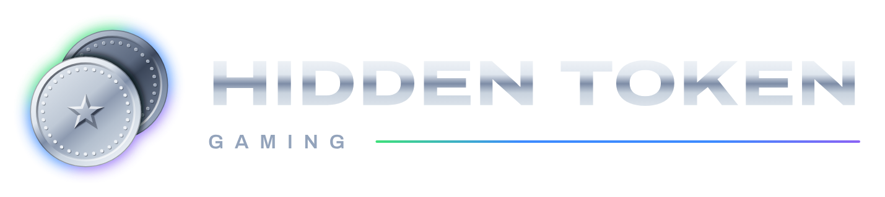

# brand

Hidden Token Gaming's logo, colours and artwork: the mark, the lockups, the Discord server icon and
the War Dogs server banner (#6).



## Where the name comes from

In the 1990s, John worked at a video arcade. When his friends came in, they said it was like he had a
"hidden token": he could play any machine he liked. That's the idea behind HTG: a place where you
always have a game to play.

The mark is two arcade tokens, with the second one hidden behind the first. There's always another
game.

## The mark

- Two chrome tokens, struck like real coins: a raised rim, raised beads and a star stamped into the
  face. Light comes from the top left. The back token is darker and partly hidden.
- A glow surrounds the pair, running green, then a wide band of blue, then purple. It follows the
  chrome's angle, from top left to bottom right. The glow sits only outside the two tokens, never
  between them.
- The one-colour version swaps the shading for cut-outs and a thin gap between the tokens. Use it on
  light backgrounds, in a single colour, or at 24 px and below.

| File | Use |
|---|---|
| [`logo/htg-mark.svg`](logo/htg-mark.svg) | The main mark, full colour with glow, on dark backgrounds |
| [`logo/htg-mark-noglow.svg`](logo/htg-mark-noglow.svg) | Full colour without the glow, for 64 px and below |
| [`logo/htg-mark-mono.svg`](logo/htg-mark-mono.svg) | One colour (`currentColor`), for light backgrounds and small sizes |
| [`logo/htg-lockup.svg`](logo/htg-lockup.svg) | Mark plus wordmark, side by side, on dark backgrounds |
| [`logo/htg-lockup-stacked.svg`](logo/htg-lockup-stacked.svg) | Mark above the wordmark, on dark backgrounds |
| [`logo/htg-lockup-mono.svg`](logo/htg-lockup-mono.svg) | Side-by-side lockup in ink, for light backgrounds |
| [`logo/png/`](logo/png/) | PNG renders: the mark at 1024 to 128 px, without glow at 64 and 32 px, one colour at 512 px in black and white, and each lockup at 2× |
| [`discord/server-icon-512.png`](discord/server-icon-512.png) | The Discord server icon |
| [`wardogs/server-banner-1024x256.png`](wardogs/server-banner-1024x256.png) | The War Dogs server-browser banner (`ServerImageURL`) |

### Using it

- Put full-colour versions on the dark ground (`#070b17`) or something close to it. Chrome and the
  glow disappear on light backgrounds; use the one-colour version there.
- Leave clear space around the mark of at least a quarter of its width.
- Don't recolour, stretch, rotate or outline the tokens, and don't add effects.
- **Never combine the mark with game logos, game art or look-alikes.** HTG's identity is its own;
  the [publisher rules](../content/legal/publisher-rules.md) say what each publisher allows.

## Wordmark

"HIDDEN TOKEN" is set in [Archivo](https://github.com/Omnibus-Type/Archivo) at weight 800 and its
widest width (125), in chrome. "GAMING" sits below in Archivo 600, tracked out at 0.55em, with a thin
green-blue-purple line beside it, centred on the capitals. The stacked lockup puts a line on each
side of "GAMING". The one-colour lockup uses a solid slate line.

Archivo is under the SIL Open Font License ([`fonts/OFL.txt`](fonts/OFL.txt)). The lockups and
banner have their text converted to outlines, so they don't need the font installed.

## Colours

Dark is the designed default. Light mode follows the visitor's system setting. The values are in
[`tokens.json`](tokens.json) and, as CSS custom properties, in [`tokens.css`](tokens.css).

| Token | Dark | Light |
|---|---|---|
| Ground | `#070b17` | `#f2f5f9` |
| Surface | `#0f1526` | `#ffffff` |
| Line | `#1f2a44` | `#d5dce6` |
| Text | `#e8eef6` (16.8:1) | `#0b1222` |
| Muted text | `#93a3bb` (7.7:1) | `#4f5d74` (6.1:1) |

| Accent | Value | Job | As text in light mode |
|---|---|---|---|
| Green (lead) | `#3ee07a` (11.4:1 on the dark ground) | Logo glow, calls to action, links, "online" | `#0a7a3a` (5.0:1) |
| Blue | `#3d8bff` (5.9:1) | "New", secondary links | `#1554d1` (6.0:1) |
| Purple | `#8a63f5` (4.9:1) | Events | `#6a3fd8` (5.8:1) |

Contrast is against that mode's ground. Every text pairing passes WCAG AA (4.5:1). Text on a green
button is the ground colour (11.4:1).

Chrome (logo and wordmark) runs `#ffffff` → `#dfe6ee` → `#7d8ca6` → `#c9d3de` → `#f4f7fb`.

## Discord

The server icon is ready to upload. A server banner and invite splash need server boost levels the
server doesn't have yet, so they aren't part of this kit.

## War Dogs banner

The server browser shows a 1024×256 image from `ServerImageURL`. War Dogs only accepts images hosted
on catbox.moe, imgbb.com or postimg.cc; any other host fails every config edit with a 422. Upload
[`wardogs/server-banner-1024x256.png`](wardogs/server-banner-1024x256.png) to one of them and set
the URL in the server config.

## Rebuilding

Every SVG is generated by [`tools/build.py`](tools/build.py) from the design's geometry, and every
PNG is rendered from those SVGs by [`tools/render.sh`](tools/render.sh) in headless Chrome. Change
the script, not the SVGs.

```sh
python3 -m venv .venv && .venv/bin/pip install fonttools uharfbuzz
.venv/bin/python brand/tools/build.py
brand/tools/render.sh   # needs google-chrome and ImageMagick
```

Variations of the one-colour mark for different parts of the community (staff, events, each game)
are tracked in #19.
